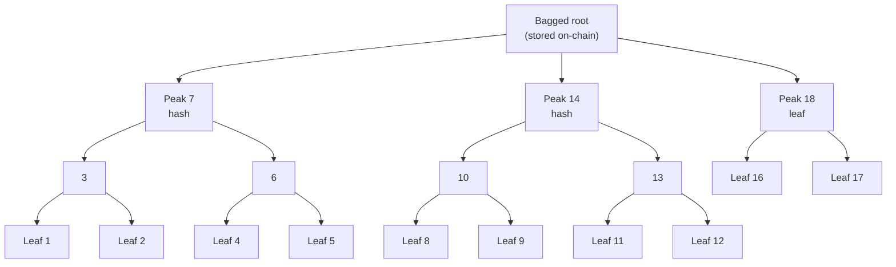

Every time a Bridger deposits tokens or a Maker locks funds for an order, that event is permanently recorded in a **Merkle Mountain Range (MMR)** — an append-only cryptographic ledger maintained by the smart contracts on each chain. This ledger is the foundation for ZK proof verification: to claim settlement, you must prove your deposit exists in the MMR.

## What a Merkle Mountain Range is

An MMR is a type of Merkle tree designed for append-only workloads. Instead of a single balanced binary tree, an MMR consists of a series of perfect binary "peaks" that grow as new leaves are added. Each leaf is a deposit or lock event; each internal node is the hash of its two children.



The peaks are combined into a single **root hash** using an iterative process called peak bagging. This root is stored on-chain after every new deposit and is the value the ZK circuit checks inclusion proofs against.

<Info>
  The MMR is append-only by design. No deposit can be removed or altered once recorded. This gives you a tamper-proof history of all trade events on each chain.
</Info>

## Why ProofBridge uses an MMR

ProofBridge uses an MMR rather than a simpler data structure for two reasons:

**Efficient inclusion proofs.** For a ZK circuit to verify that your deposit is in the tree, it needs a Merkle proof — a set of sibling hashes along the path from your leaf to the root. In an MMR, these proofs are compact and efficient to generate and verify, even as the tree grows to millions of entries.

**ZK compatibility.** The MMR uses **Poseidon2** as its hash function. Poseidon2 is specifically designed for use inside ZK circuits — it is far cheaper to compute in-circuit than SHA-256 or keccak256. This keeps proof generation fast and on-chain verification costs low.

## What it means for your deposit

When you create an order on the `OrderPortal`, the contract appends your order hash to the MMR and updates the root. When the Maker locks funds on the `AdManager`, that event is also appended. The relayer then reads both trees, constructs the inclusion proofs, and feeds them into the Noir circuit to generate the final ZK proof.

Your deposit is verifiable by anyone who knows the root hash, without needing to trust the relayer or any off-chain data source.

## Cross-chain compatibility

ProofBridge maintains an independent MMR on every supported chain. The EVM implementation (Ethereum Sepolia) and the Stellar implementation both use the same Poseidon2 hash function and the same tree construction algorithm. As a result, both implementations produce **identical root hashes** for identical input data.

This cross-chain equivalence is what makes verification possible: a proof generated against Chain A's MMR root can be checked by Chain B's `Verifier` contract, because both chains agree on how roots are computed.

<Note>
  The `MerkleManager` contract on each chain is permission-controlled: only the `AdManager` and `OrderPortal` contracts can append new entries. This prevents anyone from injecting fake deposits into the tree.
</Note>

## Technical details

| Property | Value |
|---|---|
| Hash function | Poseidon2 |
| Elliptic curve | BN254 (for field modular reduction) |
| Storage | On-chain (`MerkleManager` contract) and off-chain by the relayer |
| Root history | Maintained on-chain for proof validation against historical roots |
| Cross-chain parity | EVM and Stellar produce identical roots for the same input |

## For developers

The MMR implementation is published as an npm package you can use in your own integrations:

```bash
npm install proofbridge-mmr
```

The package is a TypeScript implementation that produces cryptographically identical outputs to the on-chain Solidity contracts. You can use it to reconstruct the MMR from blockchain events, generate inclusion proofs offline, or build tooling that validates ProofBridge settlement state.

```typescript
import { MerkleMountainRange, Poseidon2Hasher, LevelDB } from "proofbridge-mmr";

const db = new LevelDB("./mmr-data");
await db.init();

const hasher = new Poseidon2Hasher();
const mmr = new MerkleMountainRange("my-mmr", db, hasher);
await mmr.init();

// Append an order hash leaf
await mmr.append(orderHash);

// Generate an inclusion proof for index 2
const proof = await mmr.getMerkleProof(2);
```

See the [proofbridge-mmr package on npm](https://www.npmjs.com/package/proofbridge-mmr) for the full API reference.
