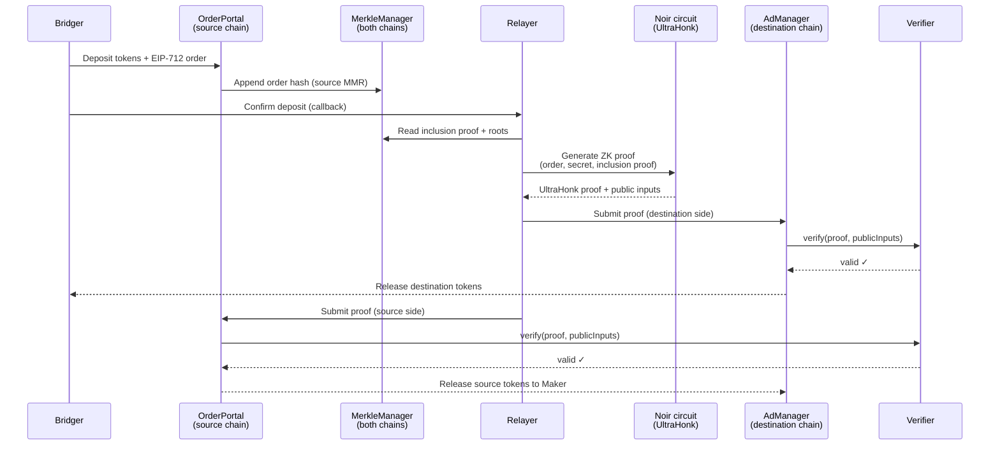

When you bridge tokens on ProofBridge, neither you nor the Maker needs to trust each other or the relayer. Instead, settlement is enforced by a **zero-knowledge proof** — a cryptographic guarantee that a deposit happened exactly as claimed, verified directly by smart contracts on both chains.

## What ZK proofs do for you

A zero-knowledge proof lets one party prove a statement is true without revealing the underlying data. On ProofBridge, the proof answers one question: *did this specific deposit occur on the source chain, and does it satisfy all the trade constraints?*

The contracts on the destination chain verify the proof automatically. If the proof is valid, funds are released. If it's invalid — or if someone tries to replay an old proof — the transaction reverts. You never need to trust the relayer to behave honestly.

<Info>
  ZK proof generation happens in the background. As a user, you simply confirm your deposit transaction and wait. The relayer generates and submits the proof on your behalf.
</Info>

## Why this enables trustless settlement

Traditional bridges rely on a trusted committee or validator set to attest that a deposit occurred. If those validators are compromised or collude, funds can be stolen or blocked. ProofBridge replaces that trust assumption with math.

The proof is verified by an on-chain `Verifier` contract using the **UltraHonk** proving system on the **BN254** elliptic curve. The verification key is stored in the contract at deployment and cannot be changed. This means:

- The relayer cannot fabricate a valid proof for a non-existent deposit.
- A Maker cannot claim settlement without a matching Bridger deposit.
- No off-chain authority can block or redirect your funds once a valid proof is submitted.

## The nullifier system

To prevent double-spending, ProofBridge uses a **nullifier** — a one-time cryptographic value derived from your private secret and the order hash.

<Steps>
  <Step title="Secret generation">
    When you create an order, a private secret is generated and associated with your trade. This secret never leaves your control and is never stored on-chain in plain form.
  </Step>
  <Step title="Nullifier calculation">
    The nullifier is computed as `poseidon2(secret, orderHashMod)`. The Bridger's nullifier uses one half of the computation; the Maker's uses the other. Each nullifier is unique to a single trade.
  </Step>
  <Step title="Proof includes the nullifier">
    The ZK circuit validates that the nullifier was derived correctly from the secret, and includes it as a public output of the proof.
  </Step>
  <Step title="On-chain recording">
    When the proof is submitted, the contract records the nullifier hash. Any future attempt to submit the same proof — or a different proof with the same nullifier — is rejected.
  </Step>
</Steps>

This system guarantees that each deposit can only be claimed once, without the contract ever seeing the underlying secret.

## The proof circuit

ProofBridge's ZK circuits are written in **Noir**, a domain-specific language for zero-knowledge proofs developed by Aztec. The proving system used is **UltraHonk**, which produces compact proofs optimized for on-chain verification.

The deposit circuit validates all of the following in a single proof:

<AccordionGroup>
  <Accordion title="Order hash correctness">
    The circuit checks that the EIP-712 order hash in the proof matches the hash derived from the trade parameters both parties agreed to. This prevents any modification to the trade terms after signing.
  </Accordion>
  <Accordion title="MMR inclusion">
    The circuit verifies a Merkle inclusion proof showing that the order hash exists in the source chain's Merkle Mountain Range. This proves the deposit was recorded on-chain without revealing the full tree history.
  </Accordion>
  <Accordion title="Nullifier validity">
    The circuit confirms that the nullifier was correctly derived from the prover's secret and the order hash, without revealing the secret itself. This is the core privacy guarantee.
  </Accordion>
  <Accordion title="Amount and expiry bounds">
    The circuit enforces that the transferred amount is within the bounds specified in the order and that the proof is not being submitted after the order has expired.
  </Accordion>
  <Accordion title="Chain flag">
    The circuit includes a chain flag (0 for source chain, 1 for destination chain) to ensure each proof is only valid for its intended contract. This prevents cross-chain replay attacks.
  </Accordion>
</AccordionGroup>

## End-to-end proof flow

The proof is verified independently on each chain. Both sides settle atomically from the user's perspective — if either verification fails, neither releases funds.

## User experience

From your perspective as a Maker or Bridger, ZK proofs are invisible:

1. You sign a transaction to deposit or lock tokens.
2. The relayer detects the on-chain event and requests a proof from the circuit.
3. The circuit generates the proof, and the relayer submits it to both chains.
4. The contracts verify the proof and release funds automatically.

You do not need to run any proving software, understand elliptic curve cryptography, or monitor the process. If proof generation or submission fails, the relayer retries automatically.

<Warning>
  BLS signature aggregation — which will allow both parties to co-sign a proof of agreement — is currently in development. Until it ships, the relayer handles proof submission. Funds remain protected by on-chain proof verification regardless.
</Warning>
