Every bridge transfer on ProofBridge creates an order that moves through a defined lifecycle before both parties receive their funds. The **My Orders** page lets you track the current state of any order, find on-chain transaction hashes for both chains, and take action if a transfer is stalled. This guide explains each lifecycle state and what to do if something goes wrong.

## View your orders

Open [ProofBridge](https://proof-bridge.vercel.app), connect your wallet, and navigate to **My Orders**. The page lists all orders associated with your address, with the most recent at the top. Click any order to open its detail view.

Each order detail page shows:

- **Order ID**: The unique identifier used by the relayer.
- **Route**: Source chain → destination chain, token pair, and amount.
- **Status**: The current lifecycle state.
- **Source transaction**: The hash of your deposit transaction on the source chain.
- **Destination transaction**: The hash of the settlement transaction on the destination chain (available after proof submission).
- **Created at** / **Updated at**: Timestamps.

## Order lifecycle

Orders progress through the following states in sequence:

```mermaid
stateDiagram-v2
    [*] --> Created: Deposit tx confirmed on source chain
    Created --> Locked: Bridger sends /confirm callback;<br/>Maker locks liquidity
    Locked --> ProofGenerated: Noir circuit produces ZK proof
    ProofGenerated --> Settled: Proof verified on both chains;<br/>funds released
    Settled --> [*]

    Created --> Error: Pre-auth rejected<br/>(no on-chain funds at risk)
    Locked --> Error: Proof generation fails<br/>after retry budget
    ProofGenerated --> Error: On-chain verification fails
    Error --> [*]
```

| Status | What it means |
|---|---|
| **Created** | Your deposit transaction has been submitted. The relayer is waiting for your confirmation callback. |
| **Locked** | The relayer confirmed your deposit and the Maker has locked their destination-chain liquidity for your order. |
| **Proof generated** | The ZK proof has been computed and submitted to both chains. Settlement transactions are pending. |
| **Settled** | Both sides have been unlocked. You received your destination tokens; the Maker received your source tokens. |

<Note>
  The transition from **Created** to **Locked** requires you to send a confirmation callback to the relayer after your deposit transaction is confirmed on-chain. If you closed the app before doing this, see [Manually confirm your deposit](#manually-confirm-your-deposit) below.
</Note>

## Find your transaction hashes

### Source chain transaction

Your deposit transaction hash is available immediately after you submit the deposit. Find it in:

- The **My Orders** detail page under **Source transaction**.
- Your wallet's transaction history.

Paste the hash into the appropriate block explorer:

- Ethereum Sepolia: [https://sepolia.etherscan.io](https://sepolia.etherscan.io)
- Stellar Testnet: [https://stellar.expert/explorer/testnet](https://stellar.expert/explorer/testnet)

### Destination chain transaction

The destination transaction hash is available after the relayer submits the ZK proof and the settlement confirms. It appears in the order detail page under **Destination transaction** once the order reaches **Settled** status.

## Manually confirm your deposit

The ProofBridge relayer uses a pre-authorization model — it does not poll chains for events automatically. After you submit a deposit transaction, you must notify the relayer so it can verify the confirmation and proceed.

<Steps>
  <Step title="Wait for the deposit to confirm">
    Check the source-chain block explorer to confirm your deposit transaction has been included in a block. Sepolia typically takes 15–60 seconds; Stellar ledgers close every ~5 seconds.
  </Step>

  <Step title="Open the order detail page">
    In ProofBridge, navigate to **My Orders** and click your order. If the status is **Created**, the relayer callback has not been sent yet.
  </Step>

  <Step title="Click Notify relayer">
    Click **Notify relayer**. The frontend sends `POST /v1/trades/:id/confirm` to the relayer with your transaction hash. The relayer verifies the on-chain confirmation and advances the order to the next state.

    <Tip>
      If the button is not visible, try refreshing the page. It appears only when the order is in **Created** status and the deposit has been confirmed on-chain.
    </Tip>
  </Step>

  <Step title="Wait for the status to update">
    Refresh the order page after a few seconds. Once the relayer verifies the deposit, the status advances to **Locked**, indicating that the Maker has reserved liquidity for your order and proof generation has begun.
  </Step>
</Steps>

## What the relayer does

After receiving your confirmation, the relayer:

1. Fetches the Merkle Mountain Range inclusion proof for your order from both chains.
2. Sends the order data and Merkle proof to the Noir ZK circuit to generate a zero-knowledge proof.
3. Submits the proof to the **AdManager** on the destination chain, releasing your destination tokens.
4. Submits the proof to the **OrderPortal** on the source chain, releasing the Maker's source-chain tokens.

You do not need to take any further action after sending the confirmation. The relayer handles proof generation and submission automatically.

## Troubleshoot a stuck order

<AccordionGroup>
  <Accordion title="Order is stuck in 'Created' for more than 2 minutes">
    The relayer has not received the confirmation callback. Navigate to the order detail page and click **Notify relayer** to send the callback manually. Make sure your deposit transaction is confirmed on-chain first.
  </Accordion>

  <Accordion title="Order is stuck in 'Locked' for more than 10 minutes">
    Proof generation is taking longer than usual. This can happen due to circuit computation load. Wait up to 15 minutes before taking further action. If the status does not advance, check whether your source-chain transaction is confirmed by viewing it in the block explorer.
  </Accordion>

  <Accordion title="Order is stuck in 'Proof generated' for more than 5 minutes">
    The settlement transactions are pending on-chain. Network congestion on either the source or destination chain can delay confirmation. Check both transaction hashes in the respective block explorers to see whether the transactions are included in blocks.
  </Accordion>

  <Accordion title="The order detail page shows an error status">
    If the pre-authorization check failed before any on-chain submission, no funds were spent. Return to the marketplace and select a different liquidity ad. If an on-chain transaction succeeded but the order shows an error, contact support with your Order ID and source transaction hash.
  </Accordion>
</AccordionGroup>

<Warning>
  Do not attempt to manually resubmit a deposit transaction if your order is already in a non-error state. Duplicate deposits are not automatically refunded. If you are unsure about the state of an order, wait for the current status to resolve before taking any action.
</Warning>
