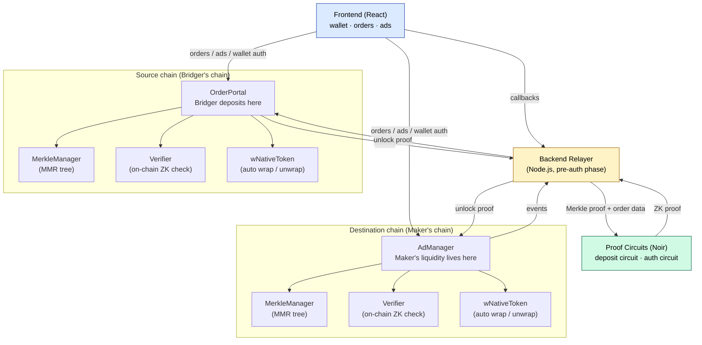

ProofBridge settles a cross-chain transfer between two users directly. A **Maker** posts liquidity on their chain, a **Bridger** deposits on their chain, and both sides unlock only after a zero-knowledge proof confirms the deposit on the counterparty chain actually happened.

This page walks through the architecture and the end-to-end data flow.

## Architecture at a glance

### What each component does

<CardGroup cols={2}>
  <Card title="Frontend (React)" icon="browser">
    Connects wallets, authenticates via SIWE (EVM) or SEP-10 (Stellar), and lets users create ads, submit orders, and monitor status.
  </Card>
  <Card title="OrderPortal" icon="arrow-right-arrow-left">
    On the source chain. Bridgers call `createOrder` to deposit tokens and register the order hash with the MerkleManager. `unlock` pays the Maker's recipient once the ZK proof verifies.
  </Card>
  <Card title="AdManager" icon="store">
    On the destination chain. Makers call `createAd` and `fundAd` to offer liquidity, then `lockForOrder` to reserve funds against a specific order. `unlock` pays the Bridger's recipient once the ZK proof verifies.
  </Card>
  <Card title="MerkleManager" icon="tree">
    Maintains an append-only Merkle Mountain Range of every order hash. Both AdManager and OrderPortal hold `MANAGER_ROLE` to append entries.
  </Card>
  <Card title="Verifier" icon="shield-check">
    Checks UltraHonk zero-knowledge proofs on-chain. AdManager and OrderPortal call it internally during every `unlock`.
  </Card>
  <Card title="wNativeToken" icon="coins">
    Wraps the chain's native asset (ETH, XLM) on deposit and unwraps on withdrawal, so native-token bridging works through the same ERC-20-style interface.
  </Card>
  <Card title="Backend Relayer" icon="server">
    During the pre-auth phase, coordinates the flow: pre-authorizes trades, watches for on-chain callbacks, triggers proof generation, and submits proofs to both chains. Cannot redirect funds — only submit proofs.
  </Card>
  <Card title="Proof Circuits (Noir)" icon="shield">
    The **deposit circuit** validates the order hash, checks MMR inclusion, and verifies nullifiers. The **auth circuit** (in progress) aggregates Maker + Bridger BLS signatures.
  </Card>
</CardGroup>

## The 12-step cross-chain flow

The scenario below follows a single transfer end-to-end. Each step is what actually happens on-chain or in the relayer.

<Steps>
  <Step title="Maker creates an ad on the destination chain">
    The Maker calls `createAd` on **AdManager**, locking their liquidity against a specific route (for example, wETH on Stellar for ETH on Sepolia). The ad becomes discoverable in the marketplace.
  </Step>
  <Step title="Bridger requests pre-authorization">
    Before submitting an on-chain order, the Bridger asks the **backend relayer** to pre-authorize the trade. The relayer validates that the ad is still open, the route is configured, and the parameters are sane.
  </Step>
  <Step title="Relayer returns a signed approval">
    The relayer returns a pre-authorization back to the user, which they include when creating the order on-chain. This is the transitional gate that the upcoming BLS aggregation layer replaces — see the [roadmap](/reference/roadmap).
  </Step>
  <Step title="Bridger creates the order on the source chain">
    The Bridger calls `createOrder` on **OrderPortal**, depositing source-chain tokens. Native tokens are automatically wrapped through `wNativeToken`. The deposit is now locked in the contract.
  </Step>
  <Step title="OrderPortal appends the order hash to the source-chain MMR">
    Inside the same transaction, OrderPortal appends the EIP-712 order hash to the source chain's **MerkleManager** MMR tree. The tree is append-only, so the record is permanent and Merkle-provable.
  </Step>
  <Step title="User triggers the relayer callback">
    Once the source-chain transaction confirms, the user triggers a callback to the relayer. The relayer checks the confirmation on-chain — it does not trust a self-reported status.
  </Step>
  <Step title="Relayer fetches Merkle proof + order data">
    The relayer pulls the MMR inclusion proof for the order hash plus the raw order data from the source chain. These are the inputs the proof circuit needs.
  </Step>
  <Step title="Relayer runs the deposit proof circuit">
    The relayer invokes the Noir **deposit circuit**. The circuit:

    - Recomputes the order hash from the struct fields and checks it matches.
    - Validates the MMR inclusion proof against the claimed root.
    - Verifies the nullifier is unused.
    - Outputs a compact ZK proof.

    No private data is revealed in the proof — only that the conditions hold.
  </Step>
  <Step title="Relayer submits the proof to AdManager (destination chain)">
    The relayer calls `AdManager.unlock(proof, ...)` on the destination chain.
  </Step>
  <Step title="Destination chain verifies and pays the Bridger">
    AdManager's internal **Verifier** checks the proof. On success, the Maker's locked liquidity is released to the Bridger's recipient address on the destination chain.
  </Step>
  <Step title="Relayer submits the proof to OrderPortal (source chain)">
    The relayer calls `OrderPortal.unlock(proof, ...)` on the source chain with the corresponding proof for the other side of the trade.
  </Step>
  <Step title="Source chain verifies and pays the Maker">
    OrderPortal's internal **Verifier** checks the proof. On success, the Bridger's deposited tokens are released to the Maker's recipient address on the source chain. The trade is complete.
  </Step>
</Steps>

<Note>
  Settlement on the two chains is not a single atomic transaction — the relayer submits a proof to each chain independently. Atomicity comes from the fact that both proofs reference the same order hash and nullifier: neither party can receive funds twice, and neither can receive funds without the opposite side's deposit being proven.
</Note>

## What zero-knowledge proofs give you

<CardGroup cols={2}>
  <Card title="Trustless verification" icon="shield-check">
    The on-chain Verifier confirms that the deposit really happened and the terms match, without trusting the relayer. The proof is the only thing that unlocks funds.
  </Card>
  <Card title="Replay prevention" icon="rotate-left">
    Each proof consumes a unique nullifier. Once used, the same proof cannot be reused to drain funds a second time.
  </Card>
  <Card title="Tamper-proof history" icon="database">
    Deposits are recorded in an append-only MMR tree per chain. The circuit checks inclusion against this tree, so tampering with the record would invalidate every proof that follows.
  </Card>
  <Card title="Chain-bound orders" icon="link">
    EIP-712 order hashes bind the trade to a specific chain ID and contract address. A proof valid on one chain cannot be replayed on another.
  </Card>
</CardGroup>

## Security guarantees

- **EIP-712 order hashes** bind every trade to specific chain IDs and contract addresses, preventing cross-chain or cross-contract replay.
- **Bidirectional chain linking** means each contract only accepts proofs from its configured counterpart chain.
- **Manager role permissions** on MerkleManager restrict which contracts can append new order hashes.
- **Collateral locking** requires Makers to have funds locked before any order is matched — so a Bridger's destination tokens exist before the trade starts.

<Warning>
  ProofBridge is currently in its pre-authorization phase. The relayer pre-authorizes trades and submits proofs, but cannot access or redirect funds. All fund releases require a valid on-chain proof. The [roadmap](/reference/roadmap) describes the transition to stateless, permissionless relayers via BLS signature aggregation.
</Warning>

## Next steps

<CardGroup cols={2}>
  <Card title="Quickstart" icon="rocket" href="/quickstart">
    Run your first cross-chain transfer on testnet.
  </Card>
  <Card title="Smart contracts" icon="file-code" href="/reference/smart-contracts">
    Full contract reference, functions, and deployed addresses.
  </Card>
  <Card title="MMR commitments" icon="tree" href="/concepts/merkle-mountain-range">
    How the append-only deposit log works.
  </Card>
  <Card title="Run locally" icon="docker" href="/contribute/run-locally">
    Bootstrap the full stack on your machine.
  </Card>
</CardGroup>
